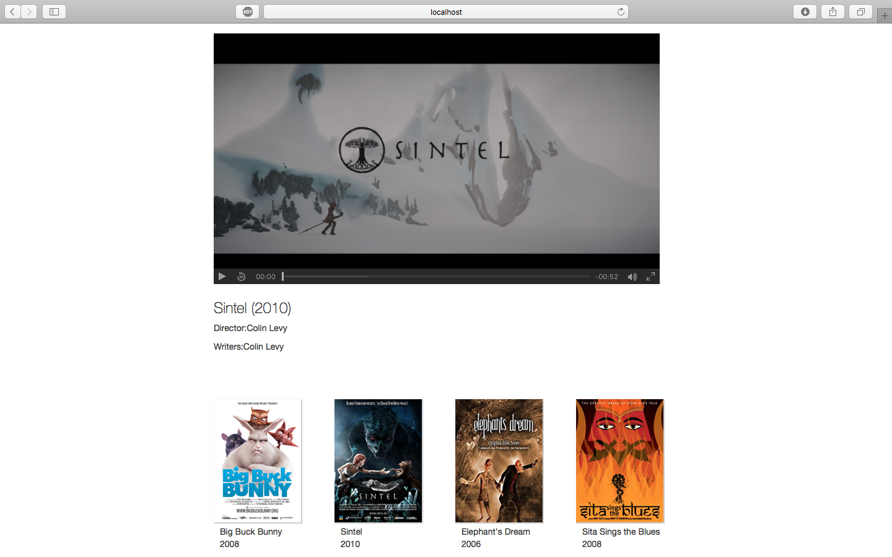
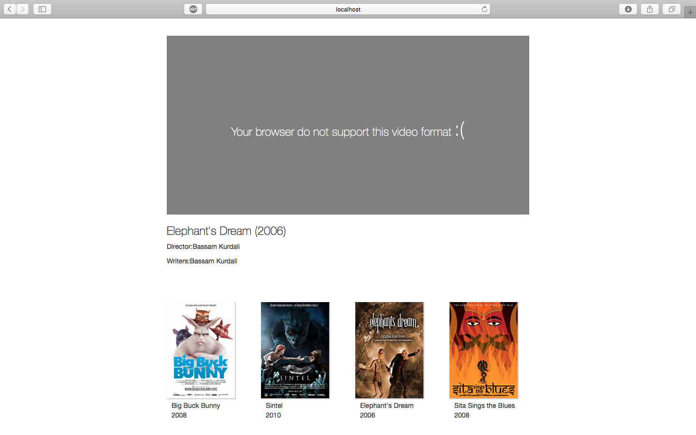

# Video-Playing-Web-App

This app plays videos which is supported in different browser.
App will check the support of video formate in current browser.
It works on desktop, table and mobile.

## Build 

npm install  

bower install

gulp

# How to use

Click on movies covers to get the trailer in media player

## Result

 

